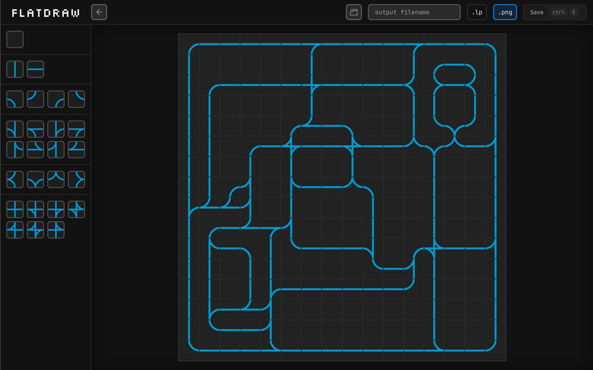

# Flatdraw

> Draw your flatland environments by hand



## Installation

### From PyPi

+ `coming soon`

### Build from Source

```bash
pip install .
```

## Running

```bash
flatdraw ui
```

### Help

```bash
flatdraw --help
```

